# plpPoolWeb-TCC 🧑‍💻📚

Aplicaçando web para gerenciamento e composição do banco de questões prontas para os laboratórios de programação da disciplina de **Paradigmas de Linguagens de Programação (PLP)** do curso de **Ciência da Computação da UFCG**.

---

## 📌 Índice

1. [Sobre o Projeto](#-sobre-o-projeto)
2. [Funcionalidades Principais](#-funcionalidades-principais)
3. [Tecnologias Utilizadas](#️-tecnologias-utilizadas)
4. [Demonstração Visual](#-demonstração-visual)
5. [Como Rodar Localmente](#-como-rodar-localmente)
6. [Deploy em Produção](#-deploy-em-produção)
7. [Estrutura do Projeto](#-estrutura-do-projeto)
8. [Modelagem de Dados (DER)](#-modelagem-de-dados-der)

---

## 📌 Sobre o Projeto

A disciplina de **Paradigmas de Linguagens de Programação (PLP)** da UFCG possui uma forte abordagem prática, desafiando os estudantes com laboratórios complexos que englobam múltiplos paradigmas (Imperativo/Procedural, Funcional e Lógico). Diante disso, manter, revisar e evoluir um banco de questões colaborativo de forma consistente entre diferentes períodos letivos é um desafio constante.

O **plpPoolWeb** surge como uma plataforma de suporte acadêmico projetada para unificar e automatizar o fluxo de trabalho entre **Professores** e **Monitores**. A aplicação centraliza o ciclo de vida das questões — desde a autoria e definição de casos de teste até a execução isolada para validação de código —, além de fornecer uma trilha de auditoria completa. Com isso, o sistema otimiza a gestão pedagógica, garantindo a qualidade das atividades, a segurança na execução dos gabaritos e a retenção do histórico histórico da disciplina.

---

## 🚀 Funcionalidades Principais

### 👨‍🏫 Visão do Professor (Gestão e Moderação)
* **Busca e Filtragem Global:** Localização rápida de questões em todo o acervo histórico através de filtros combinados por tipo (básica/avançada), tags, linguagens, enunciados e períodos letivos.
* **Homologação de Código:** Execução manual ou automatizada dos gabaritos em ambiente isolado para dupla validação antes da liberação para os alunos.
* **Revisão e Moderação:** Sistema integrado de feedback para sugerir alterações, rejeitar ou aprovar as questões submetidas pelos monitores.
* **Governança e Permissões:** Controle de acesso e gerenciamento de perfis, permitindo vincular monitores a períodos e linguagens específicas.
* **Gestão Parametrizada (Singleton):** Painel administrativo centralizado para estipular prazos (*deadlines*), metas de questões por paradigma e configurações globais do sistema.
* **Resiliência e Portabilidade de Dados:** Ferramentas de importação em lote (*bulk import*) de questões e exportação/download completo do banco de dados para rotinas de backup.

### 🧑‍🎓 Visão do Monitor (Workspace de Autoria)
* **Ambiente de Autoria Especializado:** Sandbox para criação de enunciados, vinculação de tags temáticas e cadastro estrito de casos de teste (públicos e privados).
* **Compilação e Validação Integrada:** Execução assíncrona do código do gabarito contra a suíte de testes cadastrada para garantir a corretude da questão antes da submissão para avaliação.
* **Filtros Direcionados:** Acesso facilitado ao catálogo de questões vinculadas ao seu escopo de monitoria e período vigente.
* **Consulta ao Histórico:** Navegação por versões anteriores de suas questões para reaproveitamento ou evolução de laboratórios passados.

### ⚙️ Arquitetura e Diferenciais Técnicos
* **Execução Isolada de Código (Sandbox):** Engine de execução segura que utiliza a API do Docker para compilar e rodar códigos em ambientes autocontidos, mitigando riscos de segurança no servidor.
* **Processamento Assíncrono:** Arquitetura baseada em filas de mensageria com **Celery** e **Redis** para processar as rotinas pesadas de compilação e teste em segundo plano, mantendo a interface web fluida.
* **Trilha de Auditoria Permanente:** Versionamento automático de registros via *django-simple-history* e política de *Soft Delete* (exclusão lógica), permitindo rastrear modificações e restaurar dados deletados acidentalmente.
* **Autenticação Segura:** Fluxo robusto de controle de sessões, incluindo verificação de e-mail e recuperação de credenciais.

---

## 🛠️ Tecnologias Utilizadas

### Backend & Core
| Tecnologia | Descrição |
| :--- | :--- |
| **Django** | Framework web principal |
| **Celery** | Gerenciador de tarefas assíncronas |
| **Redis** | Broker de mensagens para o Celery e cache |
| **Docker SDK** | Manipulação de containers para execução isolada de código |
| **Django Simple History** | Versionamento e histórico de models do banco |

### Frontend & UI
* **HTMX:** Interações dinâmicas e reativas sem a necessidade de SPAs complexas.
* **Crispy Forms + Bootstrap 5:** Estilização rápida e limpa de formulários.
* **Pygments:** Renderização e syntax highlighting de código-fonte na interface.

### Infraestrutura & DevOps
* **Nginx:** Servidor proxy reverso e gerenciamento de arquivos estáticos/media com SSL.
* **Gunicorn:** Servidor WSGI para produção.
* **PostgreSQL:** Banco de dados relacional robusto.

---

## 📸 Demonstração Visual

### 🛠️ Visão do Professor (Administração e Controle)
Interface centralizada para a gestão pedagógica, controle de prazos e auditoria de questões do sistema.

* **Filtros Avançados:** Busca dinâmica de questões correlacionadas por enunciados, tags, linguagens e períodos.
  
  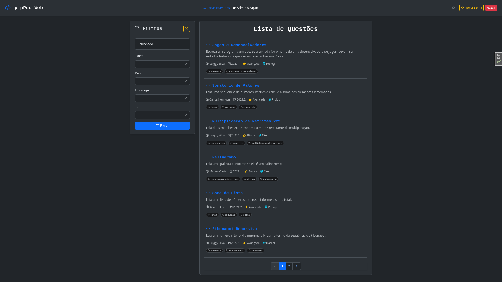

* **Inspeção de Conteúdo:** Visualização detalhada da estrutura da questão, incluindo metadados, enunciado e cobertura dos casos de teste (públicos e privados).
  
  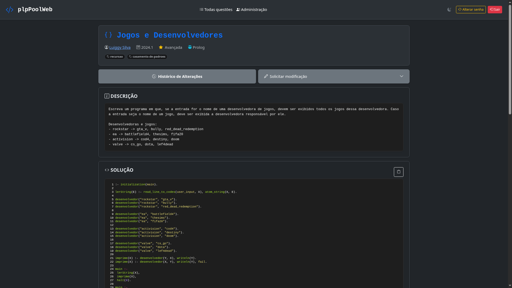
  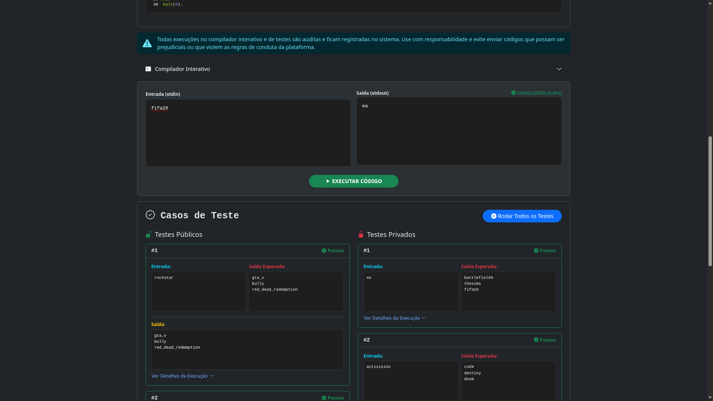

* **Painel de Configuração Global:** Controle total sobre os parâmetros do sistema, permitindo gerenciar tags, periodos, metas de questões por linguagem, deadlines de entrega, usuários (professores/monitores) e gerenciamento de backup.
  
  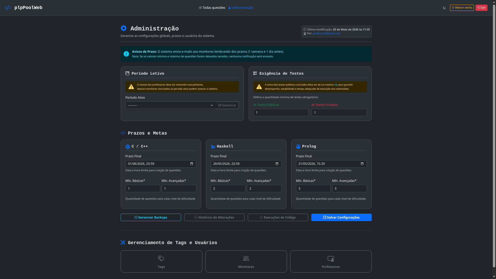

---

### 🧪 Visão do Monitor (Workspace de Criação)
Ambiente focado na produtividade dos monitores para a elaboração e homologação das atividades.

* **Fluxo de Trabalho:** Dashboard simplificado com as questões associadas ao monitor para o período letivo vigente.
  
  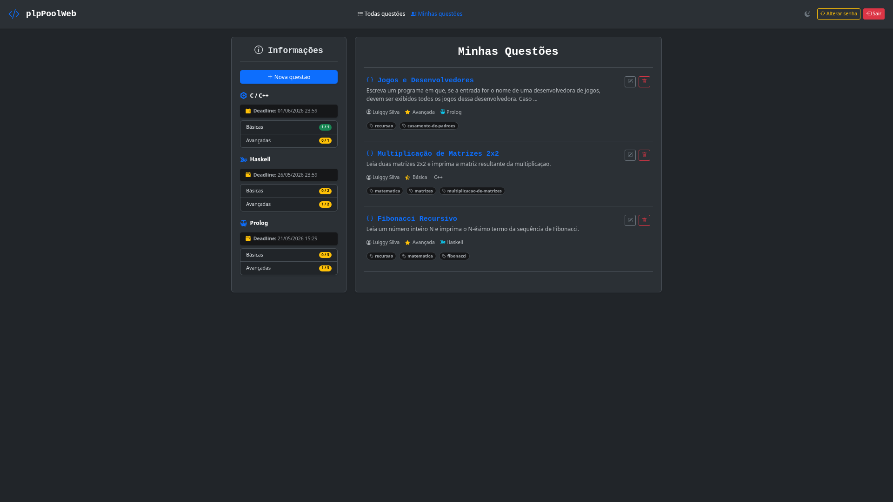

* **Sandbox e Sandbox de Testes:** Interface interativa para criação de enunciados e cadastro de gabaritos. Conta com um compilador integrado para executar e validar o código diretamente contra a suíte de testes configurada antes da submissão final.
  
  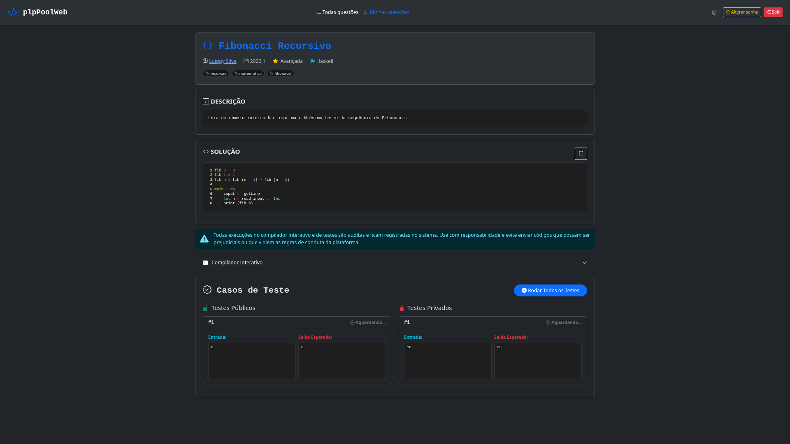
  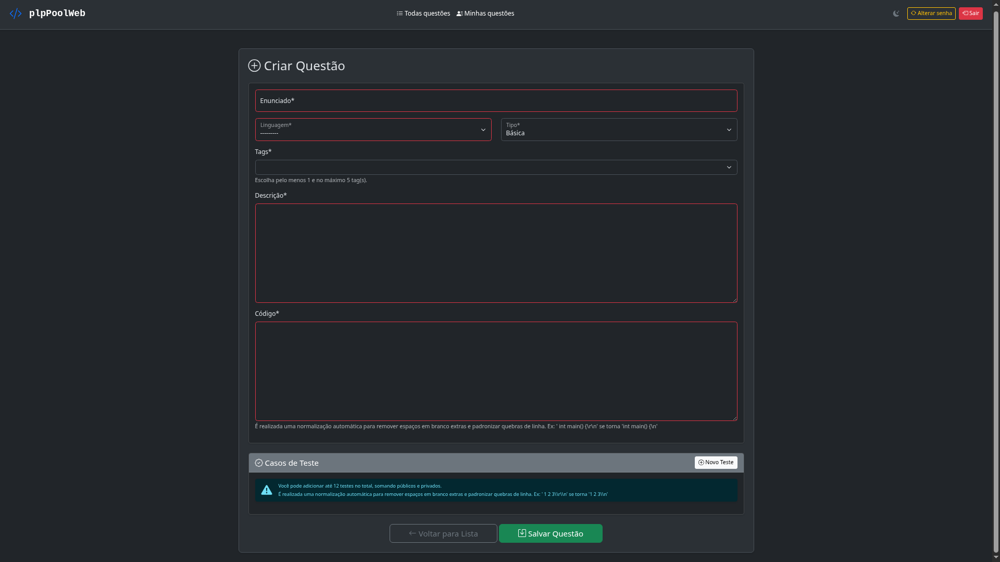

---

### 🔍 Trilha de Auditoria e Histórico
Mecanismo completo de versionamento e rastreabilidade (via *django-simple-history*) que garante a integridade, transparência e segurança de todas as modificações realizadas no ecossistema da aplicação.

* **Rastreamento e Comparação:** Visualização cronológica do ciclo de vida dos dados, permitindo auditar quem alterou qual campo e comparar versões antigas com as atuais.
  
  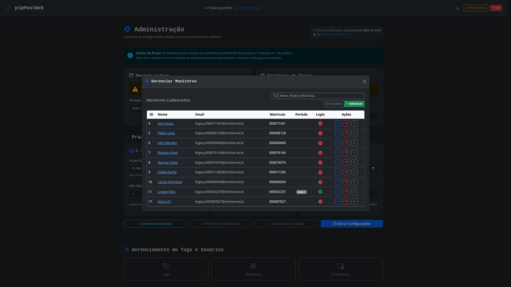
  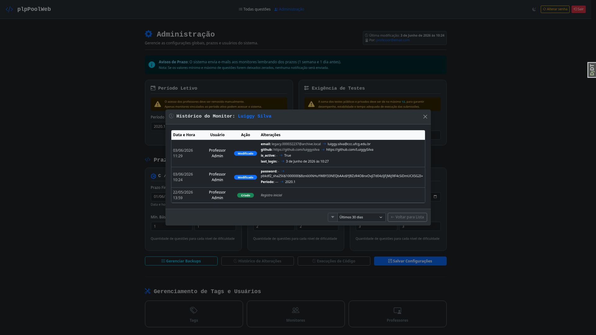

* **Recuperação de Dados (Soft Delete):** Painel de controle para consulta e restauração imediata de registros excluídos logicamente, blindando o banco de dados contra perdas acidentais.
  
  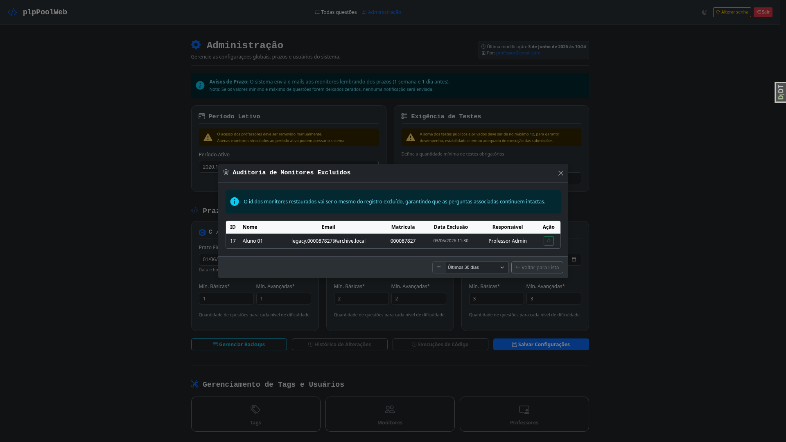

* **Auditoria de Parâmetros Globais:** Linha do tempo contendo todas as modificações feitas nas configurações cruciais do sistema, como prazos e metas de questões.
  
  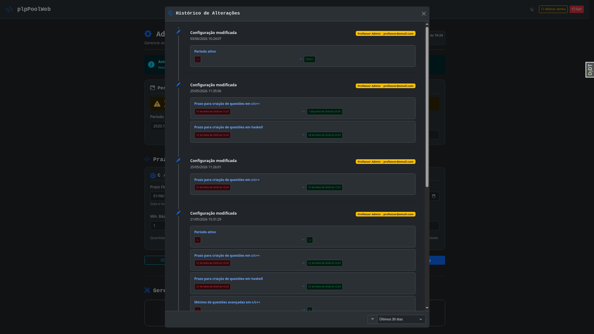

* **Logs de Execução de Código:** Registro e rastreabilidade detalhada de todas as submissões e testes de código processados pela engine de compilação.
  
  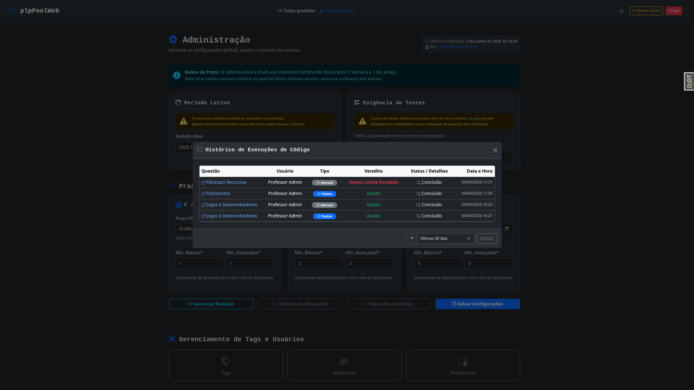


## 💻 Como Rodar Localmente

### Pré-requisitos
* Python 3.11+ e **Poetry** instalados.
* Docker e Docker Compose instalados (necessário para o ambiente de execução de código e Redis).

### Passo a Passo

1. **Clone o repositório:**
```bash
git clone [https://github.com/LuiggySilva/plpPoolWeb-TCC.git](https://github.com/LuiggySilva/plpPoolWeb-TCC.git)
cd plpPoolWeb-TCC
```

2. **Configure as variáveis de ambiente:**
Copie o arquivo de exemplo e preencha com suas configurações locais:
```bash
cp .env.example .env
```


3. **Instale as dependências (via Poetry ou ferramenta de preferência) na raiz do projeto:**
```bash
poetry install
```


4. **Rode as migrações e crie um superusuário:**
```bash
cd app
python manage.py migrate
python manage.py createsuperuser
```


5. **Inicie o worker do Celery (em um terminal separado):**
```bash
celery -A core worker -l info
```


6. **Rode o servidor de desenvolvimento:**
```bash
python manage.py runserver
```


Acesse em: `http://127.0.0.1:8000/`


> Observações: 
> - Para testar a funcionalidade de execução de código, certifique-se de que o Docker está rodando localmente, pois a aplicação utiliza a API do Docker para criar containers isolados para compilar e executar os códigos submetidos.
> - Novas contas (incluindo a do superusuário) precisam ser validadas via e-mail. Para testes locais, o email é enviado para o console, então verifique o terminal para obter o link de ativação.

---

## 🌐 Deploy em Produção

O projeto está totalmente conteinerizado e pronto para produção usando a estrutura do diretório `nginx/` e o arquivo `docker-compose.yml`.

Para subir o ambiente completo de produção (Django + Gunicorn + Nginx + Celery + Redis + Postgres):

1. Certifique-se de que os certificados SSL estão na pasta `nginx/certs/`.
2. Configure o `.env` com `DEBUG=False` e chaves de segurança fortes.
3. Execute o comando:
```bash
docker compose up -d --build

```


O Nginx escutará nas portas padrão `80` e `443`, servindo os arquivos em `staticfiles/` e `mediafiles/` automaticamente de forma otimizada.

---

## 📂 Estrutura do Projeto

```text
plpPoolWeb-TCC/
├── app/                      # Código fonte da aplicação Django
│   ├── code_compiler/        # App responsável pelo isolamento e execução de código
│   ├── core/                 # Configurações do projeto (settings.py, celery.py, urls.py)
│   ├── questions/            # App de gerenciamento de questões, tags, testes e períodos
│   ├── user/                 # App de gerenciamento de professores, monitores, permissões e backups
│   ├── templates/            # Templates HTML (UI global da aplicação)
│   └── manage.py
├── nginx/                    # Arquivos de configuração do Servidor Web & Proxy Reverso
│   ├── certs/                # Certificados SSL para HTTPS
│   └── nginx.conf            # Configuração do Nginx
├── docker-compose.yml        # Orquestração dos containers (Web, Worker, Redis, DB)
├── pyproject.toml            # Declaração de dependências e grupos de ferramentas (Ruff, Black)
└── README.md

```

Incluir o comando de geração e explicar o que está acontecendo no gráfico dá um toque muito sofisticado ao projeto. Mostra para a banca do TCC e para outros desenvolvedores que você domina as ferramentas de introspecção do Django.

Aqui está uma versão excelente para o seu `README.md`, utilizando um acordeão para esconder o comando técnico e manter o visual do documento limpo:

---

## 📐 Modelagem de Dados (DER)

A arquitetura de dados do **plpPoolWeb** foi projetada de forma modular e relacional, segregando as responsabilidades de controle de acesso, gestão pedagógica e auditoria. 

O Diagrama de Entidade-Relacionamento (DER) abaixo ilustra o mapeamento dos modelos das aplicações principais (`user`, `questions` e `code_compiler`), evidenciando as relações de dependência, chaves estrangeiras e heranças estruturais:

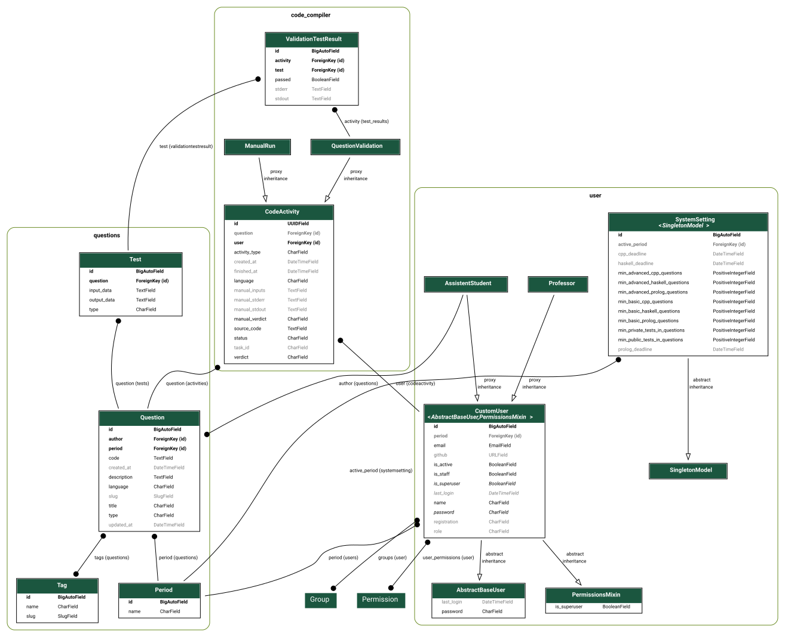